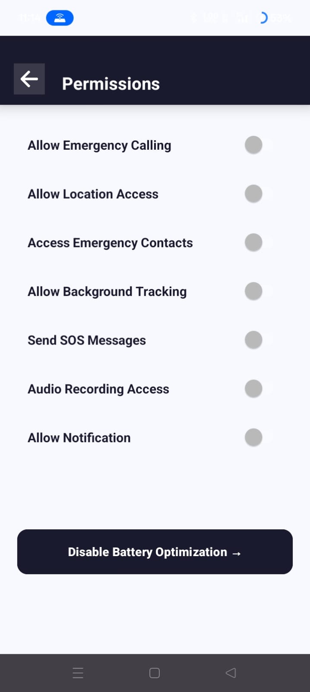
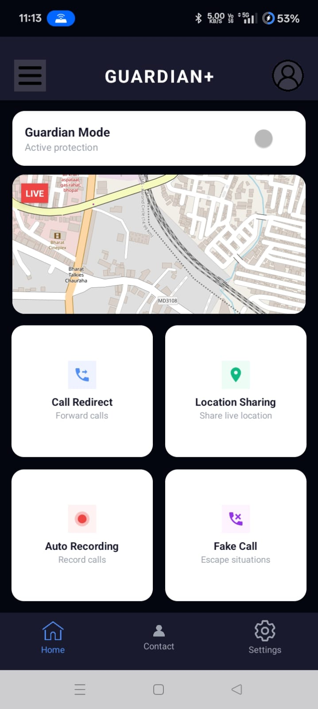
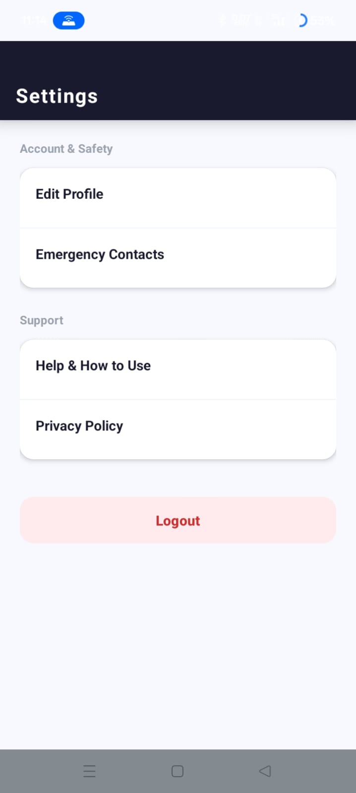

# Guardian 🛡️
**Advanced Android Safety Application**

Guardian is a real-time safety solution designed for immediate emergency assistance. It focuses on background reliability and automated SOS triggers.

## 🚀 Key Features
* **Emergency SOS:** Background triggers for instant alerts.
* **Live Tracking:** Real-time location integration via Google Maps API.
* **Geofencing:** Automatic notifications for safe and unsafe zones.
* **Security:** Secure Login/Signup and Profile management.

## 🛠️ Tech Stack
* **Language:** Java
* **Platform:** Android SDK
* **Backend:** Firebase (Authentication & Database)

## 📥 Getting Started
Download the latest APK from the [Releases](https://github.com/ankita1090/Guardian_APP/releases) section.
## 📸 App Screenshots

  
  
  
  

